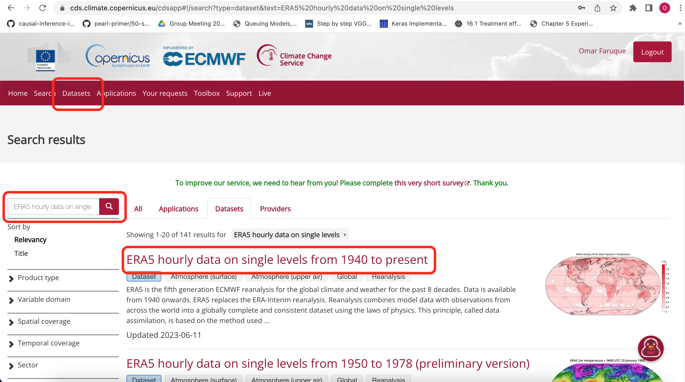
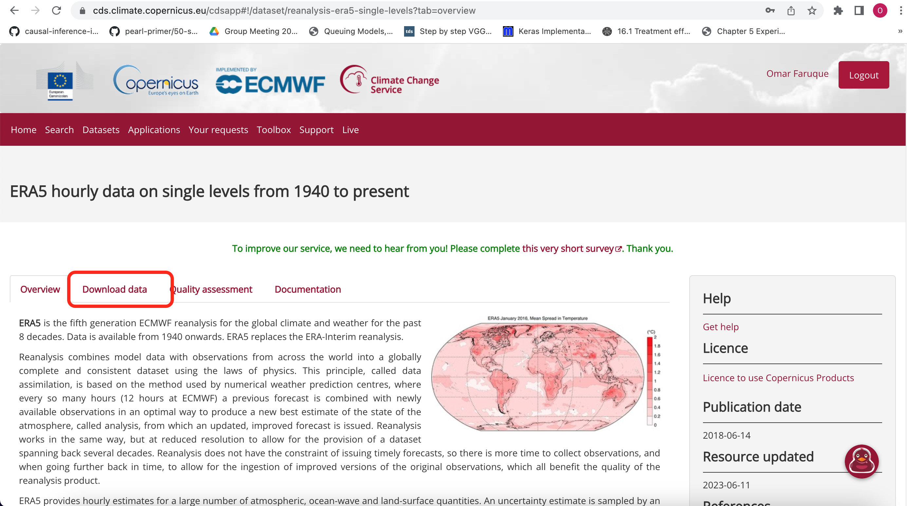
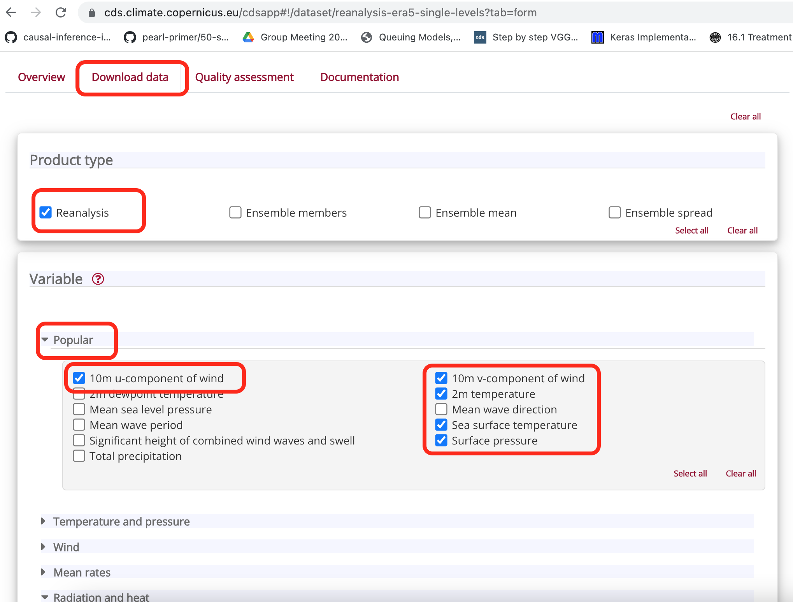
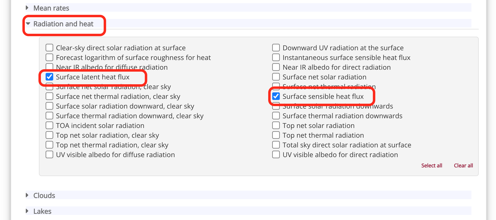
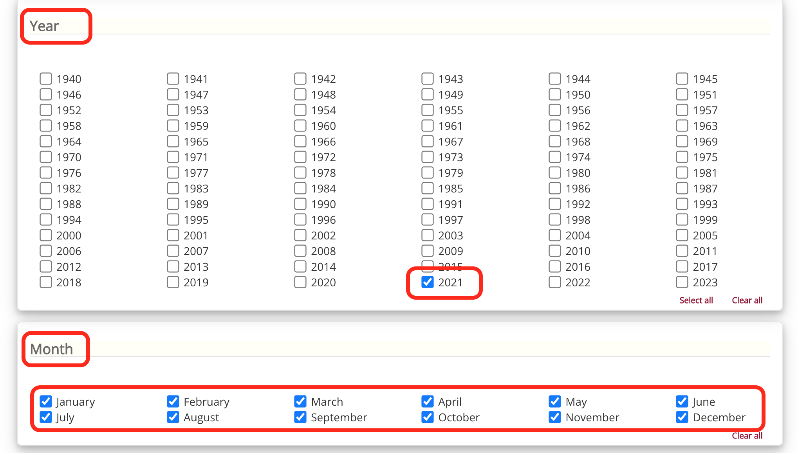
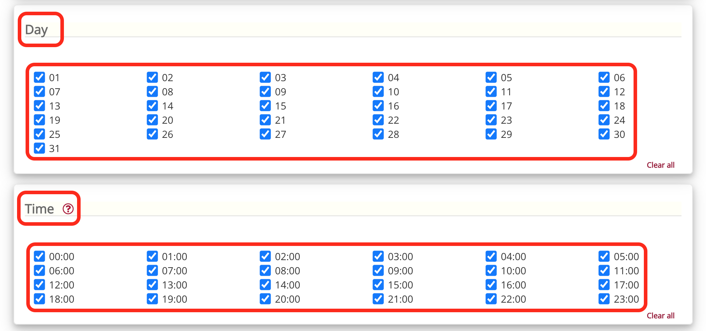
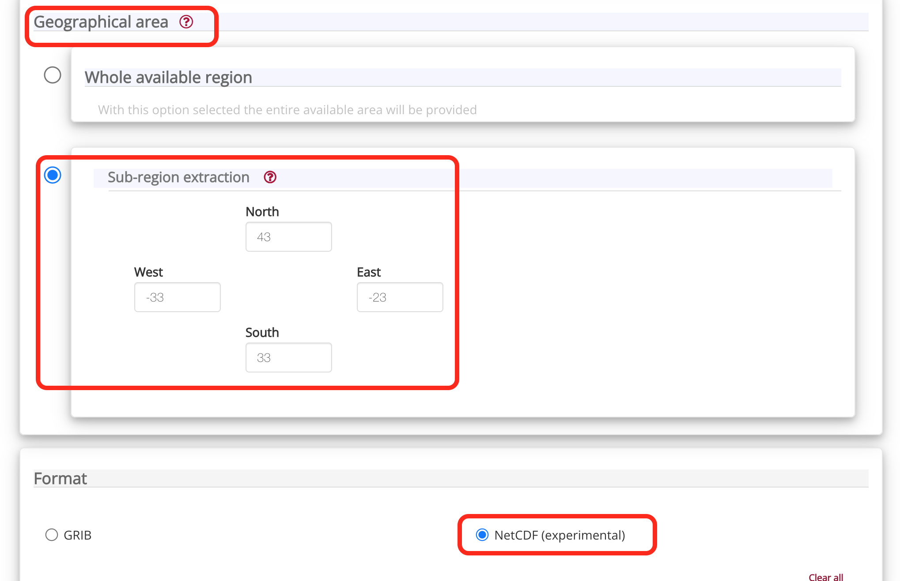
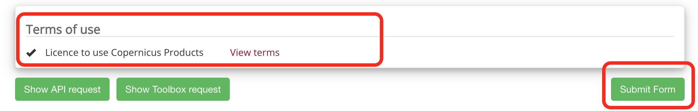
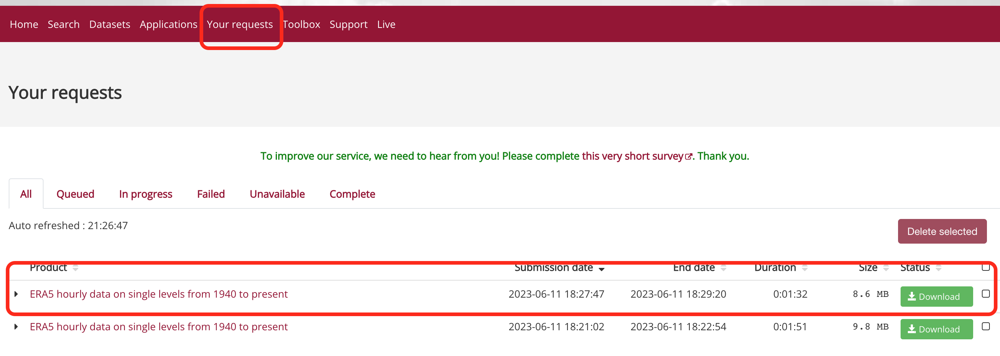

## ERA5 Reanalysis Climate Dataset Collection

Goal: This document describes the process of the ERA5 reanalysis climate data collection. Here we will download the hourly data for one year from the European Copernicus Climate Data Store for seven variables used for the unsupervised clustering task.

Follow these steps to download the dataset:

Step-1:

Create a new user in the Copernicus Climate Data Store using the following URL. Skip this step if you already have a user in the system. 

https://cds.climate.copernicus.eu/user/register?destination=%2Fcdsapp%23!%2Fhome

Step-2:

Login to the Copernicus Climate Data Store using your email ID and password through the following URL.

https://cds.climate.copernicus.eu/user/login?destination=%2Fcdsapp%23!%2Fhome

Step-3:

After login click the “**Datasets**” option from the top menu bar. On the dataset page, you will see all the datasets available to download. In the search bar type “**ERA5 hourly data on single**” and click the search button. Then from the search result select the dataset with the title “**ERA5 hourly data on single levels from 1940 to present**”.

Step-4:

The next page will show the overview of the dataset and the description of all variables included in this dataset. Here click on the “**Download data**” option as shown in the picture.

Step-5:

On this page, we have to choose different options according to our dataset requirements. We have to select "**Reanalysis**" from the product type. Then select the variables as shown in the picture. Here we have selected **7** variables from the “**Popular**” and “**Radiation and heat**” subsets. Then select the target “**Year**”, “**Month**”, “**Day**”, “**Time**”, and “**Geographical area**”. Select the “**NetCDF**” from the data format. Finally, submit the form after selecting the “**Terms of use**” option.

Step-6:

After the successful submission of the form, you will see the request on the next page, and the status will be “**In Process**”. The dataset will be ready for download after 1 to 2 minutes and you will see the green “**Download**” button in the status. You can also view all of your previous data requests from the “**Your requests**” option in the top menu.

 
